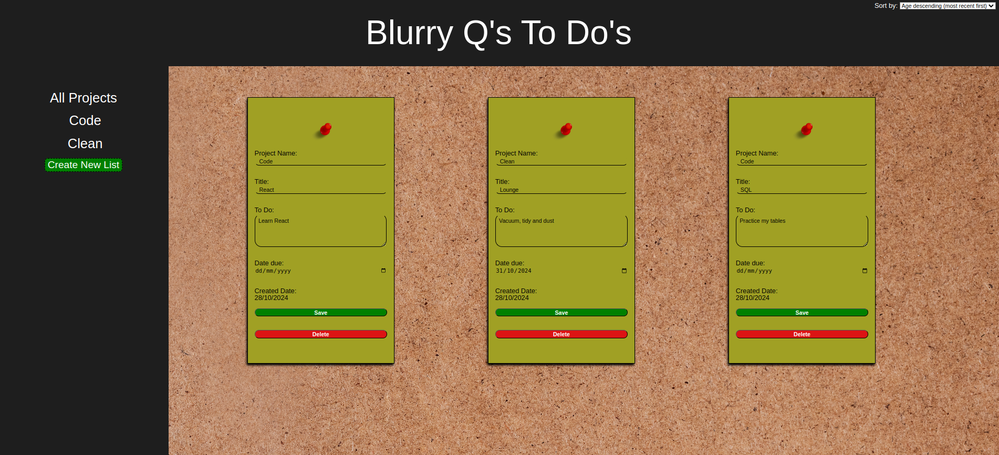

# To-Do List

## Summary



I have created a way of tracking all your to-do's. You can press the "Create New List" button to start creating a new to-do list. You are required to fill in the Project Name, Title, and To Do section, and if these are blank, you will see relevant error messages. Once saved, you can see your new list and are able to filter these by project (from the sidebar) or by sorting (from the header). This allows for the CRUD methods (Create, Read, Update & Delete).

## Features

- Dynamic list additions and project name filtering
- Input validation to ensure no false records are added
- DOM manipulation

## Setup

To get started with this project, follow the steps below:

### 1. Fork the Repository

First, you need to fork this repository to your GitHub account by clicking the "Fork" button near the top right of this page. If you are unfamiliar with this process, please follow this GitHub [guide](https://docs.github.com/en/pull-requests/collaborating-with-pull-requests/working-with-forks/fork-a-repo).

### 2. Clone the Repository

Next, clone the repository to your local machine using the following command. Make sure to replace `your-username` with your GitHub username:

```
git clone https://github.com/your-username/to-do-list
```

### 3. Install Dependencies

Now this has been done install all the npm dependencies by running the following command in your terminal/ cli:

```
npm install
```

### 4. Run Project

Once this has installed you can type the following into terminal to run the project.

```
npm run dev
```

### 5. Add To-Do's

You can now add all the to-do lists you like and be safe in the knowledge that you won't forget them.

## Challenges and Skills Demonstrated

This project was built to further my knowledge of utilizing an Immediately Invoked Function Expression (IIFE) modular file system, showing encapsulation for better organization and maintainability. I use NPM to add frameworks and localStorage to save all data locally to the user's computer.

### Skills Demonstrated:

- **Modular Design**: The project uses import statements to bring in external modules (`data.js` and `interface.js`), showing how to organize code into reusable and maintainable pieces. This demonstrates an understanding of modular code structure and separation of concerns.
- **DOM Manipulation**: Dynamic DOM updates are heavily used in this project. Functions like `updatePegboard`, `createProjectsSidebar`, and `toggleListDisplay` dynamically create or modify DOM elements, showcasing a strong grasp of DOM manipulation.
- **Event Handling**: Multiple event listeners are used throughout the project to handle user interactions, such as clicking buttons to add projects, sorting lists, toggling forms, and interacting with the To-Do list. This shows the ability to handle various user inputs and responses.
- **Data Handling**: The `Data` module handles list operations such as adding, updating, and removing To-Do items. This demonstrates proficiency in state management, as the application modifies and persists data in the form of lists and projects.
- **Form Validation**: The project includes form validation to ensure valid data entries for creating new To-Do lists (via the `validateListInput` function). It enhances user experience by prompting for valid input and preventing incomplete form submissions.
- **Sort and Filter Functions**: The `sortData` function provides functionality to sort the lists by title or date, in both ascending and descending order. This highlights an understanding of basic sorting algorithms and the ability to manipulate and reorder data arrays.
- **State Management**: The project maintains the state of the To-Do lists and projects, updating the UI in response to changes in the underlying data (i.e., adding or removing tasks, sorting, and filtering). This shows an understanding of managing and updating state dynamically.

### Challenges Faced:

- **Local Storage**: I had never used this before, so I had to learn how to use it and understand its limitations.
- **Validation & User Experience**: Implementing real-time validation for data entry, along with providing clear error feedback via the UI, was essential for ensuring a smooth user experience.
- **Object-Oriented Programming**: Saving lists as objects and passing these objects into arrays while still being able to access the correct objects from the UI was a great challenge and necessary for UI functionality.

This project demonstrates strong front-end development skills, including modular programming, DOM manipulation, event handling, and dynamic data management, all while building a functional and interactive web application. The use of modular structure and event-driven programming makes it scalable and maintainable.
